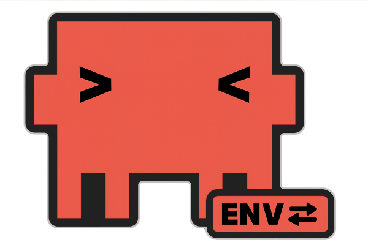

<div align="center">
  

  <h1>claudeenv</h1>

  <p>A pyenv-style environment manager for Claude Code.<br/>
  Activate domain-specific skills, agents, and rules per project.</p>

  <p>
    <a href="https://github.com/nemethk/claudeenv/releases"></a>
    <a href="https://github.com/nemethk/claudeenv/actions/workflows/ci.yaml"></a>
    <a href="LICENSE"></a>
    
    
  </p>
</div>

---

## ❓ The Challenge

Claude Code loads all your skills, agents, and rules in every session. When working across multiple domains — Go, Kubernetes, ETF, Crypto — you end up with unrelated tools always visible. There is no native way to say *"in this project, only load Go tools."*

`claudeenv` solves that.

---

## ⚙️ How It Works

Each project declares its domain in a `.claudeenv` file. When you run `claude`, `claudeenv` symlinks the matching profile's skills, agents, and rules into `.claude/` — and removes the previous ones.

```ini
# .claudeenv
[project]
golang

[global]
programming
```

```bash
cd ~/DevOps/Go/payment-service
claude    # loads only Go skills, agents, rules

cd ~/Finance/etf-tracker
claude    # loads only ETF skills, rules
```

---

## 💡 Why It Matters

Loading only the necessary profiles has a real impact on Claude Code's behaviour and cost:

| | Loaded at startup | Benefit |
|--|------------------|---------|
| Rules | yes — always | less context consumed, better domain focus |
| Skills | partially | cleaner list, less chance of wrong tool |
| Agents | no | UX only |

**Rules** are loaded into the context window at every session start. Loading irrelevant rules wastes tokens and dilutes Claude's attention. A Go project doesn't need finance rules — and with `claudeenv`, it won't have them.

---

## 👥 Who Uses It

| Audience | Use case |
|----------|----------|
| App developer | domain isolation — load only Go tools in Go projects, only ETF tools in finance projects |
| DevOps / infra | stage isolation — different rules for dev, test, prod environments |
| Skill author | variant comparison — A/B test skills and rules on the same codebase |
| CI/CD pipeline | reproducible context — `.claudeenv` committed to the repo guarantees identical Claude config on every run |

See [GUIDE.md](GUIDE.md) for full walkthroughs of all three scenarios.

---

## 📦 Installation

> For a complete step-by-step guide including profile setup see [INSTALL.md](INSTALL.md).

**macOS / Linux:**

```bash
curl -fsSL https://raw.githubusercontent.com/nemethk/claudeenv/main/scripts/install.sh | bash
```

**Homebrew:**

```bash
brew install nemethk/tap/claudeenv
```

**Go:**

```bash
GOBIN=/usr/local/bin go install github.com/nemethk/claudeenv@latest
```

**One-time shell setup** — add to `~/.zshrc` or `~/.bashrc`:

```bash
eval "$(claudeenv init)"
```

Reload your shell:

```bash
source ~/.zshrc   # or ~/.bashrc
```

---

## 🛠️ Commands

### Project — scoped to current directory

```bash
claudeenv project use golang          # set project profile, writes .claudeenv
claudeenv project add kubernetes      # add a second profile
claudeenv project list                # list available project profiles
claudeenv project reset               # remove .claudeenv
```

### Global — affects ~/.claude/ everywhere

```bash
claudeenv global use finance          # set global profile
claudeenv global list                 # list available global profiles
claudeenv global reset                # remove global profile
```

### Profile Management

```bash
claudeenv new <name>                  # scaffold a new project profile
claudeenv load                        # manually reload profiles
sudo claudeenv upgrade                # update to latest version
```

---

## `.claudeenv` File Format

**`.claudeenv`** — committed to the repo, shared with the team:

```ini
[project]
golang
kubernetes

[global]
programming
```

**`.claudeenv.local`** — gitignored, personal overrides:

```ini
# override global profile
[global]
finance

# override global profiles directory for this project
[global.dir]
~/my-personal/claudeenv/claude-global

# add to team's project profile (+ prefix required)
[project]
+etf
```

| Rule | Behaviour |
|------|-----------|
| `[global]` in local | replaces team default |
| `[global.dir]` in local | overrides `CLAUDEENV_DIR_GLOBAL` for this project |
| `[project]` in local | additive only — `+` prefix required |

---

## ⚡ Configuration

Override where profiles are stored via environment variables:

```bash
# ~/.zshrc or ~/.bashrc
export CLAUDEENV_DIR_GLOBAL=~/my-profiles/claude-global
export CLAUDEENV_DIR_PROJECT=~/work/team-profiles/claude-project
```

| Variable | Default |
|----------|---------|
| `CLAUDEENV_DIR_GLOBAL` | `~/claudeenv/claude-global` |
| `CLAUDEENV_DIR_PROJECT` | `~/claudeenv/claude-project` |

---

## 🎯 Auto-load on `cd` (optional, zsh only)

Load profiles automatically when you enter a directory:

```bash
eval "$(claudeenv init --hook)"
```

> **Note:** `--hook` generates zsh-specific code (`add-zsh-hook chpwd`). bash users should use the default `eval "$(claudeenv init)"` which wraps the `claude` command instead.

---

## 🚫 `.gitignore`

Add to your projects:

```gitignore
.claudeenv.local
.claude/skills/
.claude/agents/
.claude/rules/
```

Commit `.claudeenv` — it declares the domain for the team and CI.

---

## 💫 Inspiration

`claudeenv` follows the conventions of [pyenv](https://github.com/pyenv/pyenv), [goenv](https://github.com/go-nv/goenv), and [direnv](https://github.com/direnv/direnv).

| Tool | File | Purpose |
|------|------|---------|
| pyenv | `.python-version` | Python version per project |
| goenv | `.go-version` | Go version per project |
| claudeenv | `.claudeenv` | Claude Code profile per project |

---

## 📜 License

[MIT](LICENSE)
